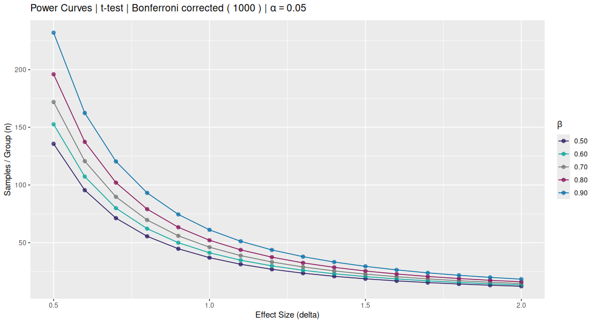
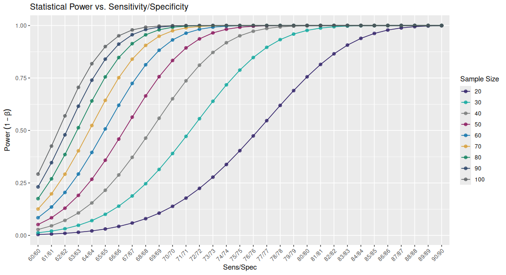
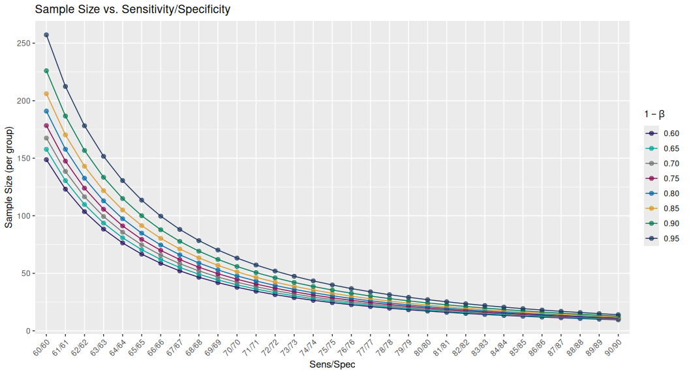

<!-- README.md is generated from README.Rmd. Please edit that file -->

# The power package

<!-- badges: start -->


[](https://cran.r-project.org/package=power)
[](https://github.com/stufield/power/actions)
[](https://cran.r-project.org/package=power)
[](https://app.codecov.io/gh/stufield/power?branch=main)
[](https://choosealicense.com/licenses/mit/)
[](https://lifecycle.r-lib.org/articles/stages.html#experimental)
<!-- badges: end -->

The `power` package contains some simple functions to empirically
simulate and estimate statistical power under various statistical test
conditions. In general, simulations are performed with *known* effect
sizes or differences, and the proportion of detected significant
*p*-values represents the empirical power, i.e. $1 - \beta$ or
`1 - TypeII` error.

The goal is typically get an idea of the required sample size given an
experimental design, statistical test, effect size, and desired power.

------------------------------------------------------------------------

## Installation

The `power` package is not currently on
[CRAN](https://CRAN.R-project.org) but you can install the latest
version from [github](https://github.com/stufield/power) via:

``` r
remotes::install_github("stufield/power")
```

## Loading `power`

Loading the `power` package is as simple as:

``` r
library(power)
```

## Plot power curves

The simplest way to generally plot power curves is via
`plot_power_curves()` which uses `power.t.test()` under the hood:

``` r
plot_power_curves(
  delta_vec = seq(0.5, 2, 0.1),
  power_vec = seq(0.5, 0.9, 0.1)
)
```



## Power curves and KS-distance

There is a loose “rule-of-thumb” relationship between
Sensitivity/Specificity and KS-distance, and of course, KS is related to
effect size. So we can visualize this relationship also via a standard
power curve:

``` r
ks_tables <- ks_power_table()
ks_tables
#> $n
#> # A tibble: 31 × 10
#>    SS       KS `power=0.60` `power=0.65` `power=0.70` `power=0.75` `power=0.80` `power=0.85`
#>    <chr> <dbl>        <dbl>        <dbl>        <dbl>        <dbl>        <dbl>        <dbl>
#>  1 60/60  0.2          39.1         43.8         49.1         55.0         62.1         70.9
#>  2 61/61  0.22         32.4         36.2         40.5         45.5         51.3         58.5
#>  3 62/62  0.24         27.2         30.5         34.1         38.2         43.0         49.1
#>  4 63/63  0.26         23.2         26.0         29.0         32.5         36.6         41.7
#>  5 64/64  0.28         20.1         22.4         25.0         28.0         31.5         35.9
#>  6 65/65  0.3          17.5         19.5         21.8         24.4         27.4         31.2
#>  7 66/66  0.32         15.4         17.2         19.1         21.4         24.1         27.4
#>  8 67/67  0.34         13.7         15.2         17.0         18.9         21.3         24.2
#>  9 68/68  0.36         12.2         13.6         15.1         16.9         19.0         21.5
#> 10 69/69  0.38         11.0         12.2         13.6         15.1         17.0         19.3
#> # ℹ 21 more rows
#> # ℹ 2 more variables: `power=0.90` <dbl>, `power=0.95` <dbl>
#> 
#> $power
#> # A tibble: 31 × 11
#>    SS       KS `n=20` `n=30` `n=40` `n=50` `n=60` `n=70` `n=80` `n=90` `n=100`
#>    <chr> <dbl>  <dbl>  <dbl>  <dbl>  <dbl>  <dbl>  <dbl>  <dbl>  <dbl>   <dbl>
#>  1 60/60  0.2   0.345  0.488  0.610  0.708  0.786  0.845  0.890  0.922   0.946
#>  2 61/61  0.22  0.406  0.567  0.694  0.790  0.859  0.907  0.940  0.961   0.976
#>  3 62/62  0.24  0.469  0.643  0.770  0.857  0.913  0.948  0.970  0.983   0.990
#>  4 63/63  0.26  0.534  0.715  0.834  0.908  0.950  0.974  0.987  0.993   0.997
#>  5 64/64  0.28  0.599  0.779  0.886  0.944  0.973  0.988  0.995  0.998   0.999
#>  6 65/65  0.3   0.661  0.835  0.926  0.968  0.987  0.995  0.998  0.999   1.00 
#>  7 66/66  0.32  0.720  0.881  0.954  0.983  0.994  0.998  0.999  1.00    1.00 
#>  8 67/67  0.34  0.774  0.918  0.973  0.992  0.998  0.999  1.00   1.00    1.00 
#>  9 68/68  0.36  0.822  0.945  0.985  0.996  0.999  1.00   1.00   1.00    1.00 
#> 10 69/69  0.38  0.863  0.965  0.992  0.998  1.00   1.00   1.00   1.00    1.00 
#> # ℹ 21 more rows
#> 
#> attr(,"class")
#> [1] "ks_pwr_table" "list"

# `power` as y-axis
plot(ks_tables)
```



``` r

# `n` as y-axis
plot(ks_tables, plot_power = FALSE)
```



------------------------------------------------------------------------

## Two-Groups

### Empirical Power via Simulation

A more robust (?) empirical calculation of power can be generated via
simulation:

``` r
# constant effect size (delta)
size_tbl <- withr::with_seed(1,
  t_power_curve(seq(10, 50, 2), delta = 0.75, nsim = 25L)
)
size_tbl
#> ── t-test Power Curve Simulation ───────────────────────────────────────────────────────────────────
#> • Sim table                 25 x 21
#> • Sims per calculation      25
#> • Repeats per sim (per box) 25
#> • Constant                  delta = 0.75
#> • Varying                   n
#> • Sequence                  10, 12, 14, 16, 18, 20, 22, 24, 26, 28, 30, 32, 34, 36, 38, 40, 42, 44, 46, 48, 50
#> ════════════════════════════════════════════════════════════════════════════════════════════════════

plot(size_tbl)
```


``` r
# constant sample size (n)
delta_tbl <- withr::with_seed(2,
  t_power_curve(seq(0.5, 2.5, 0.1), n = 10, nsim = 25L)
)
delta_tbl
#> ── t-test Power Curve Simulation ───────────────────────────────────────────────────────────────────
#> • Sim table                 25 x 21
#> • Sims per calculation      25
#> • Repeats per sim (per box) 25
#> • Constant                  n = 10
#> • Varying                   delta
#> • Sequence                  0.5, 0.6, 0.7, 0.8, 0.9, 1, 1.1, 1.2, 1.3, 1.4, 1.5, 1.6, 1.7, 1.8, 1.9, 2, 2.1, 2.2, 2.3, 2.4, 2.5
#> ════════════════════════════════════════════════════════════════════════════════════════════════════

plot(delta_tbl)
```


### Solve for Sample Size

To solve for the sample size given a corresponding power value you must
have simulate power keeping “delta” (effect size) constant and varying
`n`. For example, the `size_tbl` object created above:

``` r
solve_n(size_tbl, 0.8)
#>  power      n 
#>  0.800 22.878
```

## Fisher’s Exact for Count Data

For count data, Fisher’s Exact tests assume a 2x2 contingency matrix and
equal proportions across the margins (rows x cols):

``` r
fisher_power(0.85, 0.75, 200, 200, nsim = 200L)
#> [1] 0.68
```

### Fisher’s Power Curve

``` r
f_tbl <- fisher_power_curve(seq(50, 400, 5), p = 0.85, p_diff = -0.1,
                            nsim = 200L)
f_tbl
#> ── Fisher's Exact Power Curve Simulation ───────────────────────────────────────────────────────────
#> • Sim table                 71 x 2
#> • Sims per calculation      200
#> • p                         0.85
#> • delta                     -0.1
#> • Varying                   n
#> • Sequence `n`              50, 55, 60, 65, 70, 75, 80, 85, 90, 95, 100, 105, 110, 115, 120, 125, 130, 135, 140, 145, 150, 155, 160, 165, 170, 175, 180, 185, 190, 195, 200, 205, 210, 215, 220, 225, 230, 235, 240, 245, 250, 255, 260, 265, 270, 275, 280, 285, 290, 295, 300, 305, 310, 315, 320, 325, 330, 335, 340, 345, 350, 355, 360, 365, 370, 375, 380, 385, 390, 395, 400
#> ════════════════════════════════════════════════════════════════════════════════════════════════════
```

### Plot the Power Curve

``` r
gg_pwr <- plot(f_tbl)
gg_pwr
```


### Solve for `n`

``` r
pwr_n <- solve_n(f_tbl, 0.8)
pwr_n
#>   power       n 
#>   0.800 265.899
```

Visually check the curve and add the solution to the `ggplot`.

``` r
gg_pwr +
  ggplot2::annotate("segment",
    x        = c(pwr_n[["n"]], min(f_tbl$n)),
    xend     = c(pwr_n[["n"]],pwr_n[["n"]]),
    y        = c(min(f_tbl$power), pwr_n[["power"]]),
    yend     = c(pwr_n[["power"]], pwr_n[["power"]]),
    linetype = "dashed", colour = "#00A499")
```


