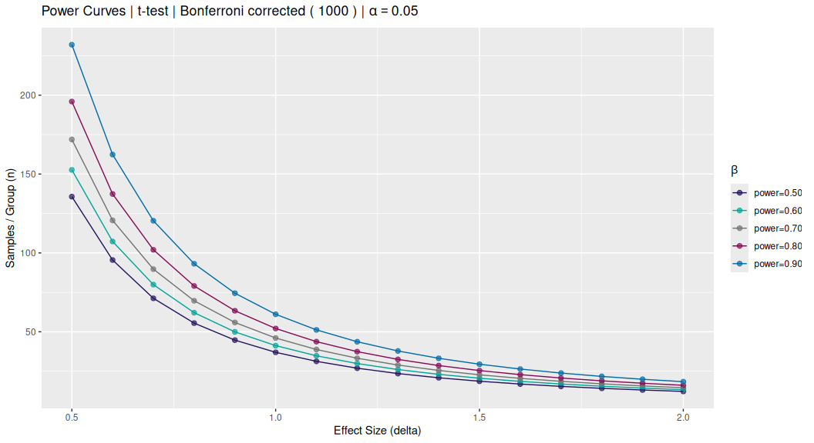
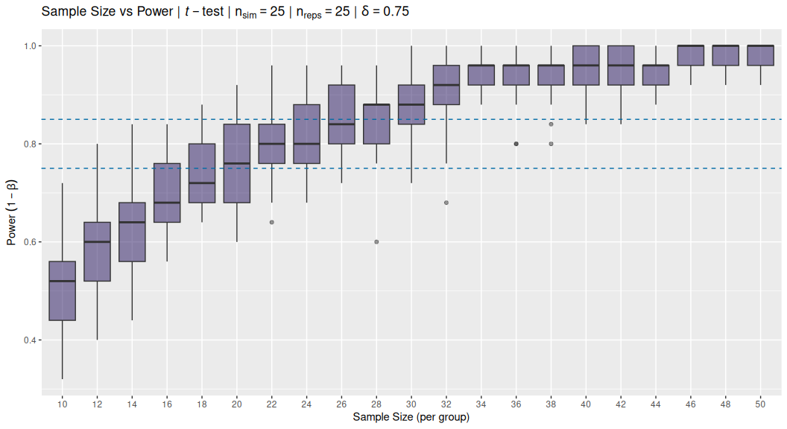
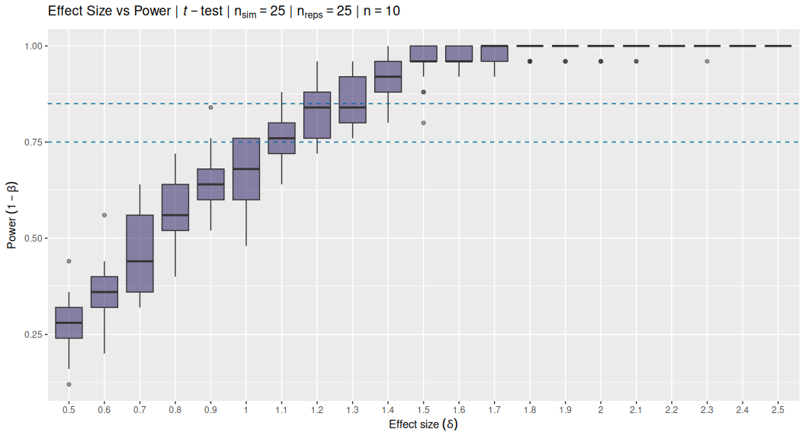
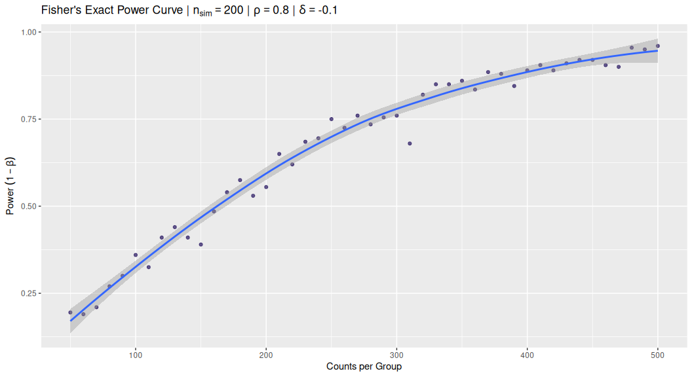
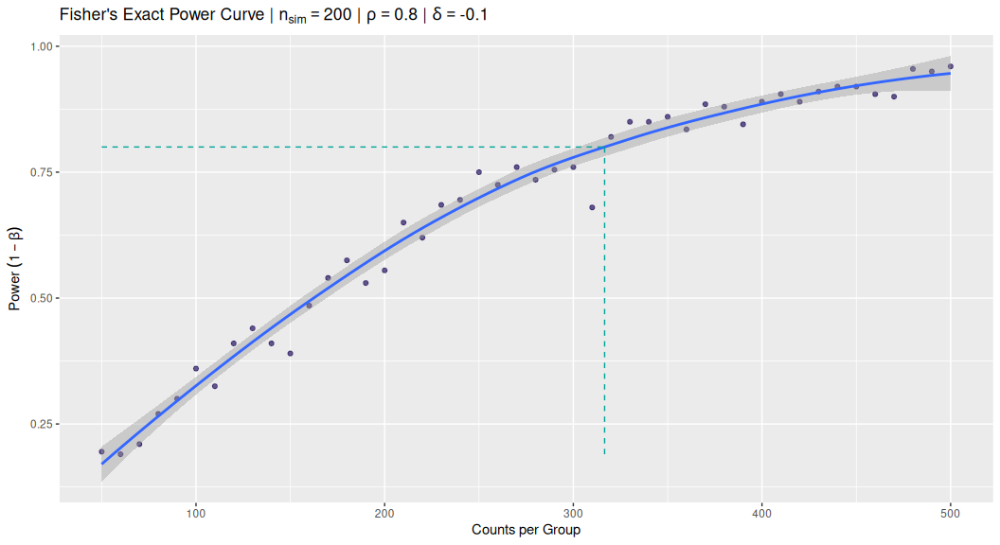

<!-- README.md is generated from README.Rmd. Please edit that file -->

# The power package

<!-- badges: start -->


[](https://cran.r-project.org/package=power)
[](https://github.com/stufield/power/actions)
[](https://cran.r-project.org/package=power)
[](https://app.codecov.io/gh/stufield/power?branch=main)
[](https://choosealicense.com/licenses/mit/)
[](https://lifecycle.r-lib.org/articles/stages.html#experimental)
<!-- badges: end -->

The `power` package contains some simple functions to empirically
simulate and estimate statistical power under various statistical test
conditions. In general, simulations are performed with *known* effect
sizes or differences, and the proportion of detected significant
*p*-values represents the empirical power, i.e. $1 - \beta$ or
`1 - TypeII` error.

The goal is typically get an idea of the required sample size given an
experimental design, statistical test, effect size, and desired power.

------------------------------------------------------------------------

## Installation

The `power` package is not currently on
[CRAN](https://CRAN.R-project.org) but you can install the latest
version from [github](https://github.com/stufield/power) via:

``` r
remotes::install_github("stufield/power")

# OR

remotes::install_version("stufield/power", "0.0.1")
```

## Loading `power`

``` r
library(power)
```

## Plot power curves

``` r
plot_power_curves(delta_vec = seq(0.5, 2, 0.1),
                  power_vec = seq(0.5, 0.9, 0.1))
```



## Two-Group Empirical Power via Simulation

``` r
# constant effect size (delta)
size_tbl <- withr::with_seed(1,
  t_power_curve(seq(10, 50, 2), delta = 0.75, nsim = 25L)
)
size_tbl
#> ── t-test Power Curve Simulation ───────────────────────────────────────────────────────────────────
#> • Sim table                 25 x 21
#> • Sims per calculation      25
#> • Repeats per sim (per box) 25
#> • Constant                  delta = 0.75
#> • Varying                   n
#> • Sequence                  10, 12, 14, 16, 18, 20, 22, 24, 26, 28, 30, 32, 34, 36, 38, 40, 42, 44, 46, 48, 50
#> ════════════════════════════════════════════════════════════════════════════════════════════════════

plot(size_tbl)
```



``` r
# constant sample size (n)
delta_tbl <- withr::with_seed(2,
  t_power_curve(seq(0.5, 2.5, 0.1), n = 10, nsim = 25L)
)
delta_tbl
#> ── t-test Power Curve Simulation ───────────────────────────────────────────────────────────────────
#> • Sim table                 25 x 21
#> • Sims per calculation      25
#> • Repeats per sim (per box) 25
#> • Constant                  n = 10
#> • Varying                   delta
#> • Sequence                  0.5, 0.6, 0.7, 0.8, 0.9, 1, 1.1, 1.2, 1.3, 1.4, 1.5, 1.6, 1.7, 1.8, 1.9, 2, 2.1, 2.2, 2.3, 2.4, 2.5
#> ════════════════════════════════════════════════════════════════════════════════════════════════════

plot(delta_tbl)
```



## Solve for Sample Size

To solve for the sample size given a corresponding power value you must
have simulate power keeping “delta” (effect size) constant and varying
`n`. For example, the `size_tbl` object created above:

``` r
solve_n(size_tbl, 0.8)
#>  power      n 
#>  0.800 22.878
```

## Fisher’s Exact for Count Data

For count data, Fisher’s Exact tests assume a 2x2 contingency matrix and
equal proportions across the margins (rows x cols):

``` r
fisher_power(0.85, 0.75, 200, 200, nsim = 200L)
#> [1] 0.69
```

## Fisher’s Power Curve

``` r
f_tbl <- fisher_power_curve(seq(50, 500, 10), p = 0.8, p_diff = -0.1, nsim = 200L)
f_tbl
#> ── Fisher's Exact Power Curve Simulation ───────────────────────────────────────────────────────────
#> • Sim table                 46 x 2
#> • Sims per calculation      200
#> • p                         0.8
#> • delta                     -0.1
#> • Varying                   n
#> • Sequence `n`              50, 60, 70, 80, 90, 100, 110, 120, 130, 140, 150, 160, 170, 180, 190, 200, 210, 220, 230, 240, 250, 260, 270, 280, 290, 300, 310, 320, 330, 340, 350, 360, 370, 380, 390, 400, 410, 420, 430, 440, 450, 460, 470, 480, 490, 500
#> ════════════════════════════════════════════════════════════════════════════════════════════════════
```

### Plot the Power Curve

``` r
gg_pwr <- plot(f_tbl)
gg_pwr
```



### Solve for `n`

``` r
pwr_n <- solve_n(f_tbl, 0.8)
pwr_n
#>   power       n 
#>   0.800 316.586
```

### Solve for `n`

Visually check the curve:

``` r
gg_pwr +
  ggplot2::annotate("segment",
    x        = c(pwr_n[["n"]], min(f_tbl$n)),
    xend     = c(pwr_n[["n"]],pwr_n[["n"]]),
    y        = c(min(f_tbl$power), pwr_n[["power"]]),
    yend     = c(pwr_n[["power"]], pwr_n[["power"]]),
    linetype = "dashed", colour = "#00A499")
```


