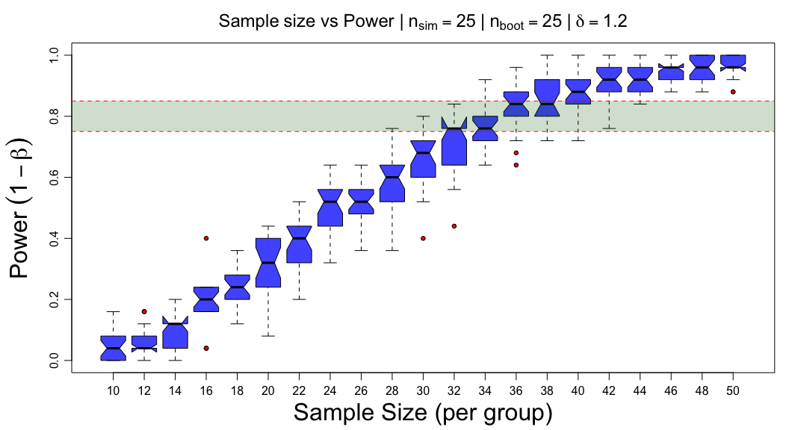
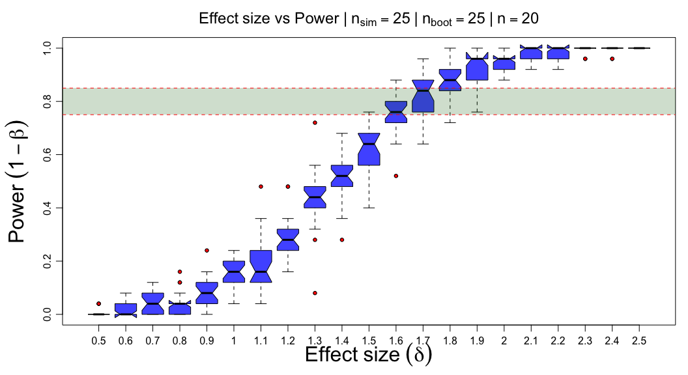

<!-- README.md is generated from README.Rmd. Please edit that file -->

# The power package

<!-- badges: start -->

[](https://lifecycle.r-lib.org/articles/stages.html#experimental)
[](https://CRAN.R-project.org/package=power)
<!-- badges: end -->

The goal of the `power` package is to …

## Installation

You can install the released version of power from
[CRAN](https://CRAN.R-project.org) with:

``` r
remotes::install_github("stufield/power")
```

## Loading `power`

``` r
library(power)
```

## Plot power curves

``` r
plotPowerCurves(effect = seq(0.5, 2, 0.1), power.vec = seq(0.5, 0.9, 0.1))
```


## Plot power simulations

``` r
# constant effect size
# must pass `nboot=`
set.seed(1)
size <- simulatePowerData(seq(10, 50, 2), delta = 1.2, nboot = 25)
size
#> **Simulation Info:**
#> 
#> Simulation table dims               25 x 21
#> Simulations per Power calculation   25
#> Simulating across (varying)         n
#> Varying sequence                    10,12,14,16,18,20,22,24,26,28,30,32,34,36,38,40,42,44,46,48,50
#> Constant                            delta = 1.2
#> Simulation repeats                  25

# plot
plot(size)
```



``` r
# constant sample size
set.seed(2)
delta <- simulatePowerData(seq(0.5, 2.5, 0.1), n = 20, nboot = 25)
delta
#> **Simulation Info:**
#> 
#> Simulation table dims               25 x 21
#> Simulations per Power calculation   25
#> Simulating across (varying)         delta
#> Varying sequence                    0.5,0.6,0.7,0.8,0.9,1,1.1,1.2,1.3,1.4,1.5,1.6,1.7,1.8,1.9,2,2.1,2.2,2.3,2.4,2.5
#> Constant                            n = 20
#> Simulation repeats                  25

# plot
plot(delta)
```


